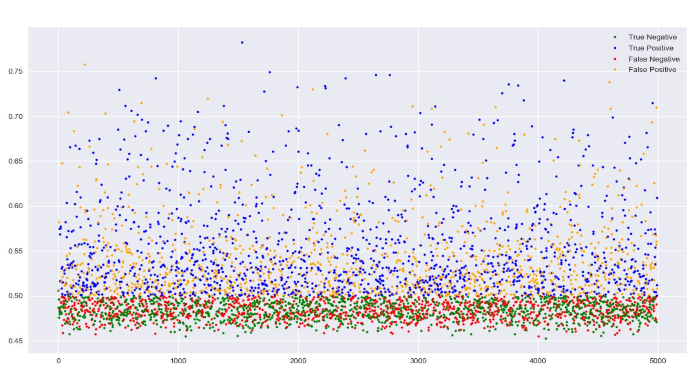

# Neural-Net-for-Bitcoin-Price-Up-Down-Prediction

LSTM Neural Network for predicting whether future price going up or not in a specific time interval

## Current Result

**data**
```
data size : (100000, 5)
input data(x) : open, high, low, close, volume

y data: 
1 : if any price increase of more than 'target_percent_change' 
    in y_window from the last close price of the x_window
0 : else

x_window_size : 100
y_window_size : 80

target_percent_change : 1
```

**model**
```
lstm(num_unit=200, dropout=0.8) -> fully connected -> sigmoid -> y_predict

loss function : cross entropy
optimizer : Adam
learning rate : 0.001 fixed

batch size : 64
epoch : 1
```

**result in graph**


**[Confusion Matrix] threshold = 0.5**
```
> total_data=4992, threshold=0.5, ignored=0, total_condition=4992
> TP:1425, FP:1161, TN:1287, FN:1119
> Accuracy:0.54, Precision:0.55, Recall:0.56, F1:0.56
```

**[Confusion Matrix] threshold = 0.6**
```
> total_data=4992, threshold=0.6, ignored=4650, total_condition=342
> TP:230, FP:112, TN:0, FN:0
> Accuracy:0.67, Precision:0.67, Recall:1.0, F1:0.8
```

**[Confusion Matrix] threshold = 0.7**
```
> total_data=4992, threshold=0.7, ignored=4955, total_condition=37
> TP:24, FP:13, TN:0, FN:0
> Accuracy:0.65, Precision:0.65, Recall:1.0, F1:0.79
```
