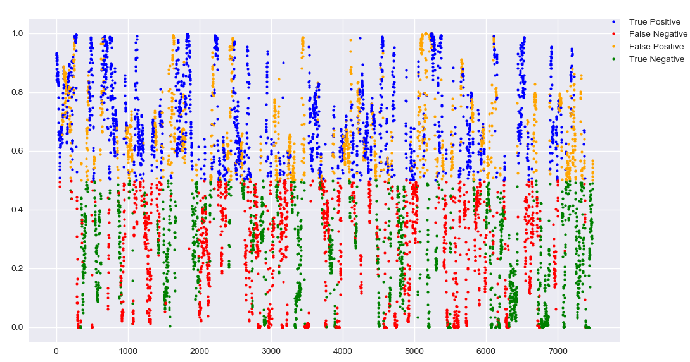
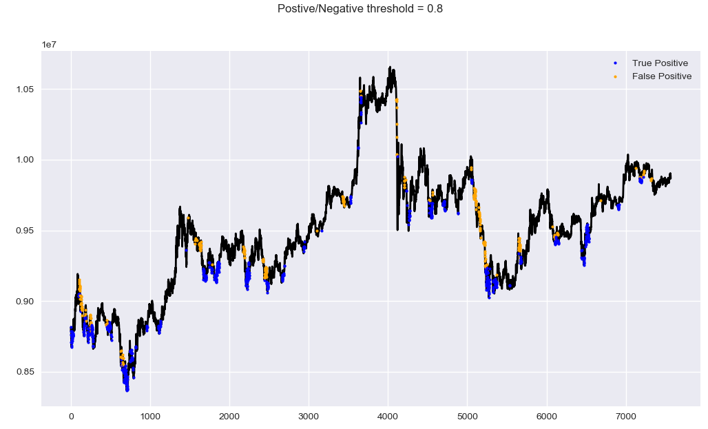

# Neural-Net-for-Bitcoin-Price-Up-Down-Prediction

LSTM Neural Network for predicting whether future price going up or not in a specific time interval

## Current Result

**data**
```
data : bitcoin 1 minute data, size of 150,000
input data(x) : open, high, low, close, volume

y data:
1 : if any price increase of more than 'target_percent_change' 
    in y_window from the last close price of the x_window
0 : else

x_window_size : 100
y_window_size : 80

target_percent_change : 1
```

**model**
```
lstm(num_unit=100, dropout=0.8) -> fully connected -> sigmoid -> y_predict

loss function : weighted cross entropy
optimizer : Adam
learning rate : 0.001 fixed

batch size : 64
epoch : 10
```

**result in graph**

**result in graph with close price**


**[Confusion Matrix] threshold = 0.5**
```
> total_data=7488, threshold=0.5, ignored=0, total_condition=7488
> TP:2245, FP:1440, TN:1870, FN:1933
> Accuracy:0.55, Precision:0.61, Recall:0.54, F1:0.57
```

**[Confusion Matrix] threshold = 0.7**
```
> total_data=7488, threshold=0.7, ignored=3644, total_condition=3844
> TP:1094, FP:589, TN:1128, FN:1033
> Accuracy:0.58, Precision:0.65, Recall:0.51, F1:0.57
```

**[Confusion Matrix] threshold = 0.8**
```
> total_data=7488, threshold=0.8, ignored=4944, total_condition=2544
> TP:692, FP:315, TN:787, FN:750
> Accuracy:0.58, Precision:0.69, Recall:0.48, F1:0.57
```

**[Confusion Matrix] threshold = 0.9**
```
> total_data=7488, threshold=0.9, ignored=5924, total_condition=1564
> TP:370, FP:167, TN:483, FN:544
> Accuracy:0.55, Precision:0.69, Recall:0.4, F1:0.51
```
